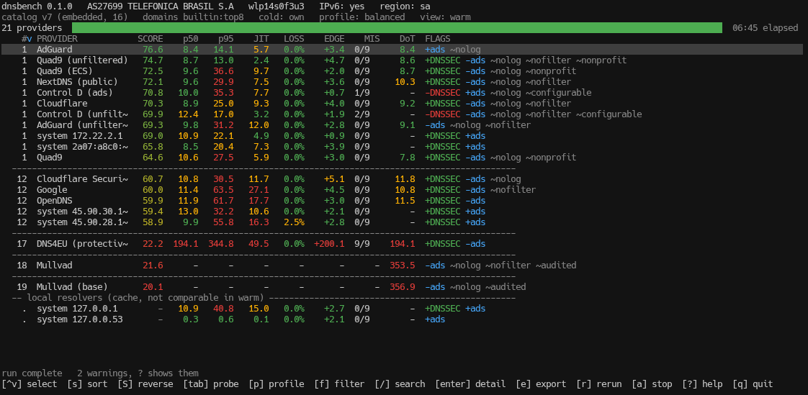
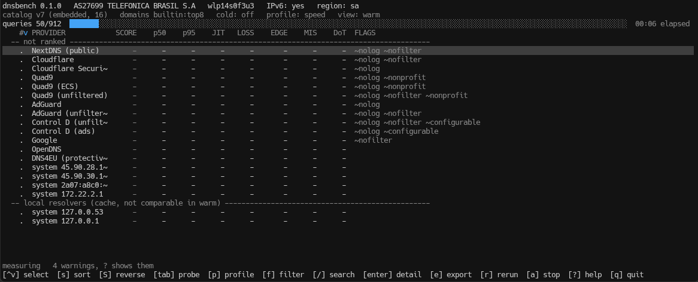

# dnsbench

[](https://github.com/Esl1h/DNSbench/actions/workflows/ci.yml)
[](LICENSE)

**Rank DNS resolvers from your own connection, including the metric nobody else measures.**

Every public DNS ranking answers the question *"which resolver is fast, on average, as seen
from datacenters around the world?"* That is a fine question. It is not your question.

Your question is *"which resolver is fast from my link, on my ISP, right now, and does it send
me to the right CDN edge afterwards?"*

`dnsbench` answers that. It is a single static binary with no runtime dependencies, no
telemetry, and no network access beyond the measurement itself. A CLI, and a full-screen
terminal interface beside it under `--tui`.



## Status

[`v0.1.0`](https://github.com/Esl1h/DNSbench/releases/tag/v0.1.0) is released, and the gap
between what is specified and what is built is still wide enough to state up front. The
documents in `docs/` are the specification and were written before any code; they describe the
finished tool, not the current binary.

**Working today:**

- UDP, TCP, DoT and DoH transports; all nine probes: `warm`, `tcp`, `cold`, `ecs`,
  `dot-fresh`, `dot-warm`, `doh`, `dnssec` and `filter`
- The composite score, five weight profiles, run-relative normalisation, and tiers from a
  bootstrap interval on the score
- Table, JSON, CSV and Markdown output against a versioned schema
- Append-only JSONL history, and `dnsbench history` to read it back: filtered by network,
  provider or time window, grouped and aggregated, or plotted as a sparkline
- Local caches and system resolvers measured and labelled apart
- ASN, operator and region detection over DNS, and transparent DNS hijack detection alongside
  it, a second address query to 8.8.8.8 compared against the one already made to OpenDNS
- The terminal interface under `--tui`: live table, sorting, filtering, search, a per-provider
  detail view, and profile cycling that re-ranks what was measured without measuring again
- The full optional catalog: `dnsbench update` fetches and verifies the DNSCrypt
  public-resolvers list, `--catalog dnscrypt` parses its `sdns://` stamps and merges them in
  under the embedded catalog, `~/.config/dnsbench/providers.toml` overrides both, and `--near`
  keeps a run to the fastest subset instead of every listed resolver
- `--watch`: repeats the run on an interval and alerts when the winning provider changes or a
  provider's edge penalty crosses a threshold
- The pinned Tranco domain set, `global.txt`'s real top 25 embedded from a citable snapshot id,
  plus regional sets for six ccTLD groupings that merge in automatically once a region is
  detected

**Not built yet:**

- DoH over HTTP/2. V's stdlib has no h2 client, so every DoH result is HTTP/1.1 and says so;
  two providers that serve DoH over h2 alone are recorded as refusing rather than as unreachable

`docs/PLAN.md` has the state of every module and what each remaining phase involves.
`docs/ROADMAP.md` has the milestones.

## Why another DNS benchmark

| Capability | GRC Bench | dnsdiag | dnspyre | Web tools | dnsbench |
|---|---|---|---|---|---|
| UDP / TCP | yes | yes | yes | no | **shipped** |
| DoT | no | yes | yes | no | **shipped** |
| DoH | no | yes | yes | yes, only | **shipped**, h1.1 |
| Forced cold cache | yes | no | partial | no | **shipped** |
| p95 / jitter | yes | yes | yes | some | **shipped** |
| Persistent vs. fresh handshake | no | no | yes | n/a | **shipped** |
| **CDN edge latency (ECS quality)** | no | no | no | no | **shipped** |
| Local / system resolver, correctly labelled | partial | no | no | no | **shipped** |
| Composite score with published weights | yes | no | no | some | **shipped** |
| Reproducible, versioned datasets | no | no | no | no | **shipped** |

The bold row is the whole point. A resolver that wins by 2 ms on lookup latency and loses by
90 ms on CDN edge selection has lost. No public tool measures that, which is the reason this
project exists rather than a patch to one of the others.

## The three claims this project makes

1. **Lookup latency is the least important of the three things a resolver does for you.**
   Answer quality (which CDN edge you get) and stability (p95, jitter, loss) matter more.
2. **A benchmark that opens a new TLS connection per query is measuring handshakes, not
   resolvers.** We measure both and label them differently.
3. **A ranking whose dataset changes between runs is not a ranking.** Domain lists are pinned
   by ID, shipped in the binary, and stamped into every result.

## Install

```sh
# from source (V >= 0.5.2)
git clone https://github.com/Esl1h/DNSbench && cd DNSbench
make build

# and, optionally, the man page and shell completions
sudo make install PREFIX=/usr/local
```

Release binaries for linux/amd64 and linux/arm64 are published per tag, statically linked,
with a `SHA256SUMS` beside them. `packaging/` carries a `PKGBUILD` for the AUR and a spec for
Fedora Copr. The binary embeds its provider catalog and domain sets.

`docs/RELEASING.md` has the procedure, and what makes a build byte-for-byte reproducible: the
compiler commit is pinned, the version and the commit are compile-time defines rather than
file edits, and the build happens at a fixed path, because V's `$embed_file` records the
absolute path of what it embedded.

## Use

```sh
dnsbench                                  # measure, print the ranked table
dnsbench --format json                    # machine-readable to stdout
dnsbench --profile privacy                # reweight the score, no re-measurement needed
dnsbench --only cloudflare,quad9-ecs      # a subset, by catalog key
dnsbench --probes warm,tcp                # pick the probes
dnsbench --history ~/.local/share/dnsbench/runs.jsonl
```

The sections below cover the highlights; `dnsbench --help` lists every flag the binary actually
accepts, which is the list to trust, and `dnsbench --version` says which commit the binary was
built from. `man dnsbench` ([packaging/dnsbench.1](packaging/dnsbench.1)) is the full reference
once installed: every flag, every exit status, every environment variable and file dnsbench
reads or writes, with worked examples for the catalog, history and watch mode.

A run refuses to start when a tunnel interface is up, because it would be measuring the tunnel
and not the link. `--force` overrides it and says so in the output.

### The terminal interface

```sh
dnsbench --tui --probes warm,cold,ecs,dot-warm,dnssec,filter --cold-zone probe.dnsbench.esli.blog
```



The table fills in while the run happens rather than appearing at the end. `s` sorts, `tab`
changes which probe fills the latency columns, `/` searches, `f` filters, `enter` opens a
per-provider detail view with the per-CDN-host edge table, and `e` writes the run out in any of
the published formats. `p` cycles the weight profile and re-ranks what has already been
measured without measuring anything again, which is the honest way to show how much of the
answer is the network and how much is the weighting.

`--no-color` and `NO_COLOR` make it plain text; `--palette colorblind` swaps green and red for
blue and orange. If `TERM` is unset or `dumb`, or the output is being piped, `--tui` says so
and falls back to the plain table. `docs/TUI.md` has the layout and the full key list.

### The cold probe

`--probes cold` asks for a name nobody has ever asked for, so every query is a cache miss by
construction and the resolver has to recurse. It needs a wildcard zone to ask against:

```sh
dnsbench --probes warm,cold --cold-zone probe.dnsbench.esli.blog
```

### The `probe.dnsbench.esli.blog` zone

This is the wildcard zone the cold probe ships pointed at by default, and it is operated by
this project, not a third-party service dnsbench happens to depend on.

- **Delegated**, a child of `esli.blog`, hosted separately on Bunny DNS (`kiki.bunny.net`,
  `coco.bunny.net`) so a mistake in the probe zone, a nameserver migration, or a traffic spike
  never touches anything else on the parent domain.
- **DNSSEC-signed**, algorithm 13 with NSEC black lies. A tool that scores resolvers on DNSSEC
  validation cannot reasonably ship an unsigned reference zone.
- **Wildcard onto RFC-reserved addresses**: `192.0.2.1` (TEST-NET-1) and `2001:db8::1` (the
  documentation prefix). Nothing on the internet routes to either, which is the point: the
  probe measures a lookup, and must never become a connection test.
- **A 60-second TTL on the wildcard**, which is not decoration: it is what every resolver
  caches the answer for, it travels in the comparison, and changing it changes the measurement.
- **Not operated by, or affiliated with, any resolver in the catalog.** `cold` measures the hop
  from a resolver to the authoritative, once root and TLD referrals are cached; an
  authoritative run by one of the resolvers under test would hand that resolver a home-field
  advantage no column in the output would explain. This ruled out hosting it on Cloudflare
  (which operates two catalog entries) and on DigitalOcean (whose nameservers resolve into
  Cloudflare's own ranges).
- **Anycast, with a São Paulo point of presence**, so the zone adds a small, comparable distance
  rather than a large constant that would swamp the very hop `cold` is trying to measure.

If the zone is ever unreachable, `cold` degrades to `wild` (recursion through whatever
authoritative a random label happens to land on) with a warning in the output, rather than
silently producing a wrong number. Point `--cold-zone` at your own wildcard DNSSEC zone instead
if you'd rather not depend on this one; `docs/DATA.md` § Cold-probe zone has the full reasoning,
the exact records, and the `kdig`/`delv` commands to verify a replacement zone before trusting
it.

### The optional DNSCrypt catalog

```sh
dnsbench update
```

Fetches the DNSCrypt public-resolvers list, several hundred resolvers, and verifies its
minisign signature against a key embedded in this binary. Verification is mandatory, there is
no flag to skip it, and a file that fails it is discarded with exit 4 while whatever was cached
before is left alone. The transport is not trusted and does not need to be; the signature is
what establishes integrity.

The list is not the default and never becomes it. Its own header warns that it includes
servers which censor, which do not validate DNSSEC, and which collect and monetise queries, so
ranking four hundred arbitrary resolvers by latency and crowning a winner would be
irresponsible. Opt in explicitly:

```sh
dnsbench --catalog dnscrypt
dnsbench --catalog dnscrypt --require nolog,dnssec,nofilter
dnsbench --catalog dnscrypt --near
```

Only DoH stamps become providers; DNSCrypt-protocol entries name an address no transport here
speaks. A key already curated in the embedded catalog is never replaced by the DNSCrypt list's
copy of the same key. `--near` runs a TCP connect against every candidate, paced the same way
the measurement plan is, and keeps the fastest 25 for the full battery instead of every listed
resolver; a candidate with nothing to dial is kept unconditionally, and `--only` bypasses the
pre-pass entirely since it is already an explicit, short list.

### History

```sh
dnsbench --history "$XDG_DATA_HOME/dnsbench/runs.jsonl" --format json   # append one run
dnsbench history --last 30d                                            # read it back
dnsbench history --last 30d --asn AS27699
dnsbench history --provider nextdns --plot
```

`--history <path>` on a normal run is where a result gets appended; `dnsbench history` is where
it gets read back. With no `--file`, it reads `$XDG_DATA_HOME/dnsbench/runs.jsonl`, the same
default location `--history` has no reason to point anywhere else. Without `--plot`, it prints
one row per network and provider: how many runs, the mean/min/max p50, and the latest score.
`--plot` needs `--provider`, since a sparkline is one series and a provider can appear on more
than one network. A network, cold mode, domain set or probe is never averaged in with another;
`network.asn` and `network.ifname` are why a fibre run and a mobile run on the same machine
never get mixed into one meaningless number.

### Watch mode

```sh
dnsbench --watch 15m --history "$XDG_DATA_HOME/dnsbench/runs.jsonl" --only quad9,cloudflare
dnsbench --watch 5m --alert-edge 50 --only quad9 --probes warm,ecs
dnsbench --watch 15m --watch-count 4   # four measurements, then stop
```

`--watch <dur>` repeats the run at a fixed interval, `<n>s`, `<n>m`, `<n>h`, `<n>d` or `<n>w`,
printing and, with `--history`, appending each measurement exactly as a single run would; run it
alongside `dnsbench history --plot` in another terminal and the plot grows with every tick.
A tick that fails is logged and the loop keeps going rather than stopping: the whole reason to
watch a link over time is that it is expected to have bad moments. Two alerts run to stderr,
docs/OUTPUT.md's own examples of what a monitoring job wants to know: the winning provider
changing, checked on every tick, and, opted into with `--alert-edge <ms>`, a provider's edge
penalty crossing that line. `--watch-count` stops the loop after that many measurements, for
scripting and testing; without it, `--watch` runs until interrupted. `--watch` and `--tui` are
two different ways of watching a run and are refused together.

### Exit codes

| Code | Meaning |
|---|---|
| 0 | Run completed |
| 1 | Run completed with errors, or interrupted, with partial results emitted |
| 2 | Usage error |
| 3 | No provider reachable, likely no connectivity |
| 4 | Catalog verification failure on `update` |

Suitable for cron and CI. The distinction that matters is between 1 and 3: a job seeing 1 has
numbers to look at, and a job seeing 3 has nothing and should not page anyone about DNS
latency.

## What it does not do

- It does not change your DNS settings. It measures and reports; you decide.
- It does not phone home. The only network traffic is the measurement itself, four DNS queries
  at startup to name the network you are on and check for transparent DNS interception, and an
  explicit `dnsbench update` when you ask for it. `--no-geo` removes the four.
- It does not publish your address. The public IP is used to look up the ASN and is then
  discarded; the output carries `AS27699` and the operator's name, never the address. A result
  is meant to be pasteable into an issue.
- It does not verify privacy claims. Flags like `nolog` come from the provider's own
  statements and are rendered in a visually distinct style. **Declared, not measured**, and
  enforced by the type system rather than by convention.
- It does not count a refusal as a dropped packet. A resolver that answers REFUSED has
  answered, and saying otherwise blames the network for a decision the operator made.

## Documentation

The documents are the specification. Where the code and a document disagree, the code is the
bug.

| Document | Contents |
|---|---|
| [docs/ARCHITECTURE.md](docs/ARCHITECTURE.md) | Module layout, data flow, concurrency model |
| [docs/METHODOLOGY.md](docs/METHODOLOGY.md) | What each probe measures and why; fairness rules |
| [docs/SCORING.md](docs/SCORING.md) | The composite score, weight profiles, tie handling |
| [docs/TUI.md](docs/TUI.md) | Screen layout, colour semantics, keybindings |
| [docs/DATA.md](docs/DATA.md) | Provider catalog, domain sets, and the cold-probe zone |
| [docs/OUTPUT.md](docs/OUTPUT.md) | JSON schema, JSONL history format, stability guarantees |
| [docs/ROADMAP.md](docs/ROADMAP.md) | Milestones and open decisions |
| [docs/PLAN.md](docs/PLAN.md) | Development phases, settled decisions, verified V facts |
| [packaging/dnsbench.1](packaging/dnsbench.1) | The man page: every flag, exit status, file and environment variable |
| [CONTRIBUTING.md](CONTRIBUTING.md) | Adding providers, running tests, code style |

## Language policy

Everything ships in English: code, comments, identifiers, CLI output, TUI strings,
documentation, commit messages, issues. The tool is used from Bauru to Nairobi; English is
the lowest-friction common denominator, not a preference.

Numbers are formatted locale-independently, with `.` as the decimal separator, so output can
be piped into anything without surprises.

## Licence

MIT.

## Prior art and credit

- **GRC DNS Benchmark**, Steve Gibson. The v2 rewrite's insight that v1 over-weighted cache
  performance shaped our warm and cold split.
- **dnsdiag**, Babak Farrokhi. `dnseval` is the closest existing tool; if you only need
  latency comparison today, use it, it is more mature.
- **DNSCrypt public-resolvers**, Frank Denis. Optional catalog source, minisign-verified.
- **Tranco**, Le Pochat et al., NDSS 2019. Pinned, reproducible domain rankings.
- *Public DNS Resolvers Meet Content Delivery Networks* (arXiv:2502.05763), the paper whose
  regional CDN-mapping numbers motivated the ECS probe.
