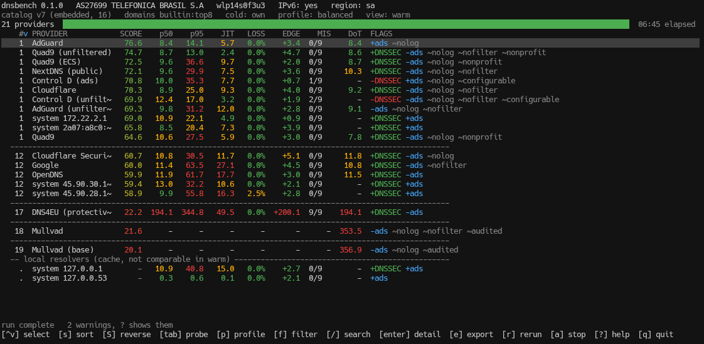
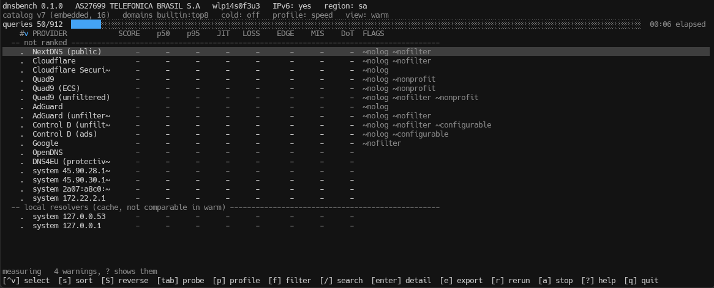

# dnsbench

[](https://github.com/Esl1h/DNSbench/actions/workflows/ci.yml)
[](LICENSE)

**Rank DNS resolvers from your own connection, including the metric nobody else measures.**

Public DNS rankings answer *"which resolver is fast, on average, as seen from datacenters
around the world?"* Your question is *"which resolver is fast from my link, on my ISP, right
now, and does it send me to the right CDN edge afterwards?"* A resolver that wins by 2 ms on
lookup latency and loses by 90 ms on CDN edge selection has lost. No public tool measures
that, which is the reason this project exists rather than a patch to one of the others.

`dnsbench` is a single static binary with no runtime dependencies, no telemetry, and no
network traffic beyond the measurement itself. A CLI, and a full-screen terminal interface
beside it under `--tui`.



## Install

```sh
# linux/amd64, statically linked, no dependencies (arm64 too, on the releases page)
curl -fsSLo dnsbench https://github.com/Esl1h/DNSbench/releases/latest/download/dnsbench-0.1.0-linux-amd64
chmod +x dnsbench && sudo mv dnsbench /usr/local/bin/
```

```sh
# from source (V >= 0.5.2)
git clone https://github.com/Esl1h/DNSbench && cd DNSbench
make build        # add CURL=1 for DoH over HTTP/2 (needs libcurl-devel)
make install      # man page and shell completions
```

`make install` honours `DESTDIR`/`PREFIX`. `packaging/` also carries a `PKGBUILD` for the AUR
and a spec for Fedora Copr. Release binaries are statically linked with a `SHA256SUMS` beside
them; `docs/RELEASING.md` describes reproducible builds. The default build is DoH over
HTTP/1.1 and dependency-free; the curl build exists for providers such as Quad9, which refuse
HTTP/1.1 outright.

## Status

[`v0.1.0`](https://github.com/Esl1h/DNSbench/releases/tag/v0.1.0) is out
([changelog](docs/CHANGELOG.md)). Working today: UDP, TCP, DoT, DoH; all nine probes; the
composite score with five profiles and tiering; JSON, CSV, Markdown and JSONL output against
a versioned schema; the TUI; history with sparklines; hijack detection; `--watch`; the
verified DNSCrypt catalog; the pinned Tranco dataset. DoQ waits for QUIC in V.

The documents in `docs/` are the specification, written before any code: they describe the
finished tool, not the current binary. `docs/PLAN.md` has per-module state; `docs/ROADMAP.md`
has milestones.

## Use

```sh
dnsbench                                  # measure, print the ranked table
dnsbench --format json                    # machine-readable to stdout
dnsbench --profile privacy                # reweight the score, no re-measurement
dnsbench --only cloudflare,quad9-ecs      # a subset, by catalog key
dnsbench --probes warm,tcp,cold           # pick the probes
dnsbench history --last 30d --plot --provider nextdns
```

[docs/USAGE.md](docs/USAGE.md) is the full guide: every probe, profile, catalog option, output
format, history, watch mode, scripting and troubleshooting, with examples.
`dnsbench --help` lists every flag the binary actually accepts, which is the list to trust;
`--version` says which commit it was built from; `man dnsbench` is the full reference once
installed. A run refuses to start when a tunnel interface is up, because it would be
measuring the tunnel and not the link; `--force` overrides and says so in the output.

### Probes

Nine, selected with `--probes`: `warm` lookups, `tcp`, `cold` (forced cache miss: every query
is a new recursion), `ecs` (CDN edge penalty per resolver), `dot-fresh` vs. `dot-warm`
(handshake vs. reuse), `doh`, `dnssec` (which resolvers actually validate) and `filter`
(measured ad-filtering verdict). `docs/METHODOLOGY.md` defines each one's semantics.

`cold` needs a wildcard DNSSEC zone to ask against. The one it ships pointed at by default,
`probe.dnsbench.esli.blog`, is operated by this project: wildcard onto RFC-reserved
addresses, 60-second TTL, anycast with a São Paulo point of presence, run by neither any
resolver in the catalog nor a third party. If it is ever unreachable, `cold` degrades to
`wild` with a warning rather than producing a wrong number. Point `--cold-zone` at your own
zone instead; `docs/DATA.md` § Cold-probe zone has the reasoning and the records.

### The terminal interface

```sh
dnsbench --tui --probes warm,cold,ecs,dot-warm,dnssec,filter
```



The table fills in while the run happens. `s` sorts, `tab` switches the probe behind the
latency columns, `/` searches, `f` filters, `enter` opens a per-provider detail view,
`e` exports, and `p` cycles the weight profile and re-ranks what was already measured without
measuring anything again, the honest way to show how much of an answer is network and how
much is weighting. `--no-color`, `NO_COLOR` and `--palette colorblind` are honoured; with no
TTY, the TUI says so and falls back to the plain table. `docs/TUI.md` has the layout and keys.

### The optional DNSCrypt catalog

```sh
dnsbench update                      # fetch + minisign-verify, mandatory, exit 4 on failure
dnsbench --catalog dnscrypt --require nolog,dnssec,nofilter
dnsbench --catalog dnscrypt --near   # keep only the 25 fastest reachable candidates
```

Fetches the DNSCrypt public-resolvers list, several hundred resolvers, and verifies its
signature against a key embedded in the binary; the transport is not trusted and does not
need to be. The list is never the default: its own header warns some entries censor, skip
DNSSEC, or monetise queries, so rank it under `--require` tags instead of crowning a winner
from four hundred arbitrary servers. Embedded-catalog entries are never overwritten.

### History

```sh
dnsbench --history ~/.local/share/dnsbench/runs.jsonl --format json   # append one run
dnsbench history --last 30d --asn AS27699                             # read it back
dnsbench history --provider nextdns --plot                            # sparkline of p50
```

Appends to JSONL, reads back filtered by network, provider or time window, grouped, or
plotted. A network, a cold mode, a domain set or a probe is never averaged in with another:
`network.asn` and `network.ifname` are why a fibre run and a mobile run on the same machine
never become one meaningless number.

### Watch mode

```sh
dnsbench --watch 15m --history ~/.local/share/dnsbench/runs.jsonl --only quad9,cloudflare
dnsbench --watch 5m --alert-edge 50 --only quad9 --probes warm,ecs
dnsbench --watch 15m --watch-count 4    # four measurements, then stop
```

Repeats the run on the interval, appending each measurement exactly as a single run would. A
failed tick is logged and the loop continues. Alerts run to stderr: the winning provider
changing, and, with `--alert-edge <ms>`, an edge penalty crossing that line. `--watch-count`
stops the loop for scripting. `--watch` and `--tui` are two ways to watch a run and are
refused together.

### Exit codes

| Code | Meaning |
|---|---|
| 0 | Run completed |
| 1 | Run completed with errors, or interrupted, with partial results emitted |
| 2 | Usage error |
| 3 | No provider reachable, likely no connectivity |
| 4 | Catalog verification failure on `update` |

The distinction that matters is between 1 and 3: a cron job or CI pipeline seeing 1 has
numbers, and one seeing 3 has nothing.

## Why another DNS benchmark

| Capability | GRC Bench | dnsdiag | dnspyre | Web tools | dnsbench |
|---|---|---|---|---|---|
| UDP / TCP | yes | yes | yes | no | **shipped** |
| DoT | no | yes | yes | no | **shipped** |
| DoH | no | yes | yes | yes, only | **shipped**, h1.1 |
| Forced cold cache | yes | no | partial | no | **shipped** |
| p95 / jitter | yes | yes | yes | some | **shipped** |
| Persistent vs. fresh handshake | no | no | yes | n/a | **shipped** |
| **CDN edge latency (ECS quality)** | no | no | no | no | **shipped** |
| Local / system resolver, correctly labelled | partial | no | no | no | **shipped** |
| Composite score with published weights | yes | no | no | some | **shipped** |
| Reproducible, versioned datasets | no | no | no | no | **shipped** |

Three claims behind the design:

1. **Lookup latency is the least important of the three things a resolver does for you.**
   Answer quality (which CDN edge you get) and stability (p95, jitter, loss) matter more.
2. **A benchmark that opens a new TLS connection per query is measuring handshakes, not
   resolvers.** We measure both and label them differently.
3. **A ranking whose dataset changes between runs is not a ranking.** Domain lists are pinned
   by ID, shipped in the binary, and stamped into every result.

## What it does not do

- **Change your DNS settings.** It measures and reports; you decide.
- **Phone home.** The only traffic is the measurement, four DNS queries at startup to name
  the network you are on and check for transparent interception (`--no-geo` skips them), and
  an explicit `dnsbench update` when you ask.
- **Publish your address.** The public IP is discarded after the ASN and operator lookup;
  the output carries `AS27699` and the operator name, so a result is pasteable into an issue.
- **Verify privacy claims.** `nolog` and friends come from the provider's own statements and
  are rendered as declared, never measured, enforced by the type system rather than convention.
- **Count a refusal as a dropped packet.** A resolver that answers REFUSED has answered;
  saying otherwise blames the network for a decision the operator made.

## Documentation

The documents are the specification. Where the code and a document disagree, the code is the
bug.

| Document | Contents |
|---|---|
| [docs/USAGE.md](docs/USAGE.md) | How to use it: probes, profiles, catalogs, history, watch, scripting |
| [docs/ARCHITECTURE.md](docs/ARCHITECTURE.md) | Module layout, data flow, concurrency model |
| [docs/METHODOLOGY.md](docs/METHODOLOGY.md) | What each probe measures and why; fairness rules |
| [docs/SCORING.md](docs/SCORING.md) | The composite score, weight profiles, tie handling |
| [docs/TUI.md](docs/TUI.md) | Screen layout, colour semantics, keybindings |
| [docs/DATA.md](docs/DATA.md) | Provider catalog, domain sets, and the cold-probe zone |
| [docs/OUTPUT.md](docs/OUTPUT.md) | JSON schema, JSONL history format, stability guarantees |
| [docs/CHANGELOG.md](docs/CHANGELOG.md) | Notable changes, SemVer policy |
| [docs/CONTRIBUTING.md](docs/CONTRIBUTING.md) | Adding providers, running tests, code style |
| [docs/SECURITY.md](docs/SECURITY.md) | How to report vulnerabilities |
| [docs/ROADMAP.md](docs/ROADMAP.md) | Milestones and open decisions |
| [docs/PLAN.md](docs/PLAN.md) | Development phases, settled decisions, verified V facts |
| [packaging/dnsbench.1](packaging/dnsbench.1) | The man page: every flag, exit status, file and environment variable |

## Licence

MIT.

## Prior art and credit

- **GRC DNS Benchmark**, Steve Gibson. The v2 rewrite's insight that v1 over-weighted cache
  performance shaped our warm and cold split.
- **dnsdiag**, Babak Farrokhi. `dnseval` is the closest existing tool; if you only need
  latency comparison today, use it, it is more mature.
- **DNSCrypt public-resolvers**, Frank Denis. Optional catalog source, minisign-verified.
- **Tranco**, Le Pochat et al., NDSS 2019. Pinned, reproducible domain rankings.
- *Public DNS Resolvers Meet Content Delivery Networks* (arXiv:2502.05763), the paper whose
  regional CDN-mapping numbers motivated the ECS probe.
